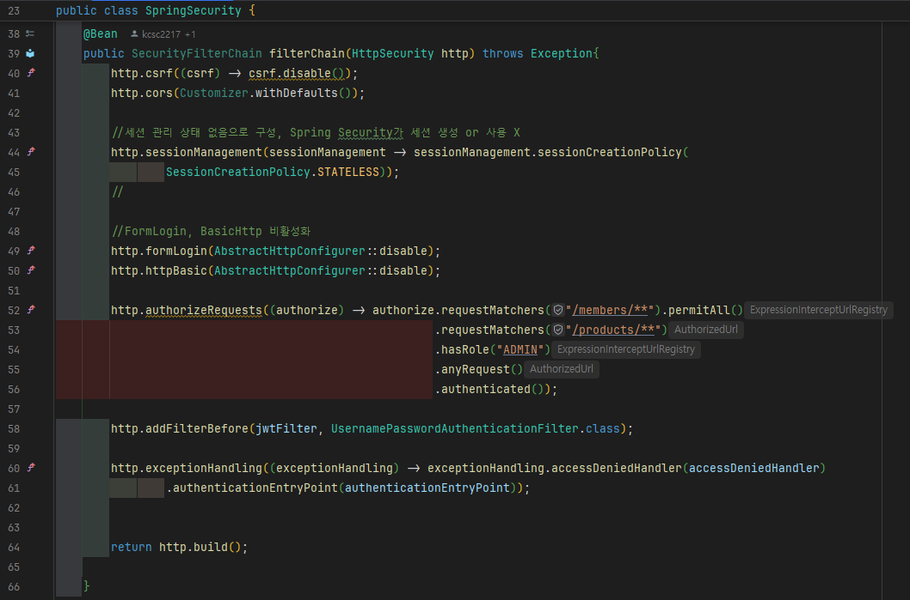
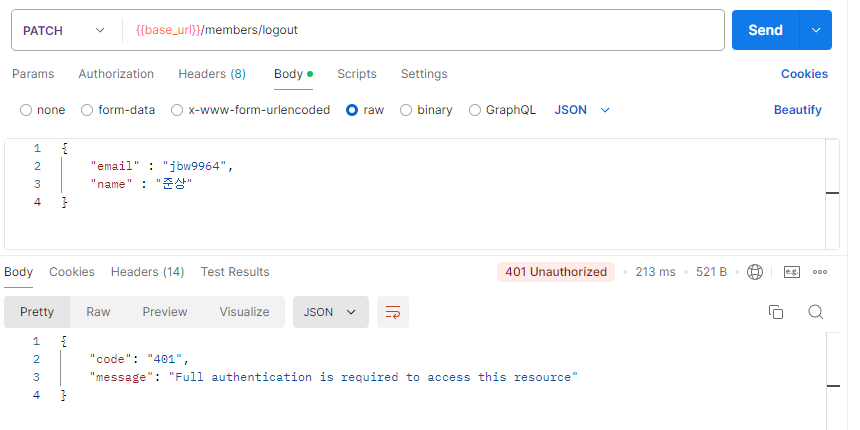
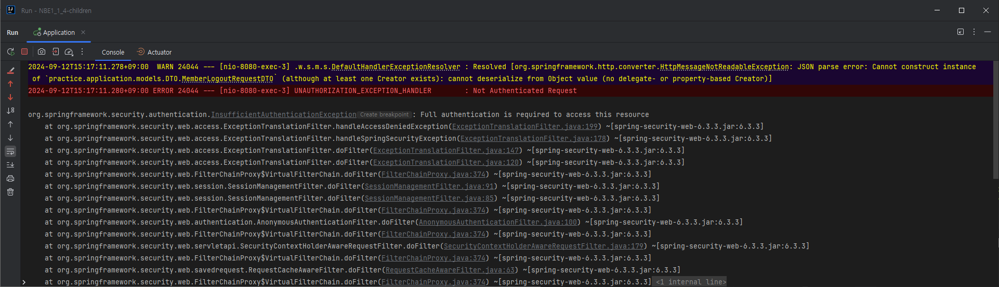
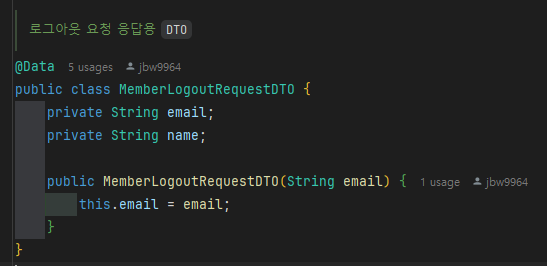
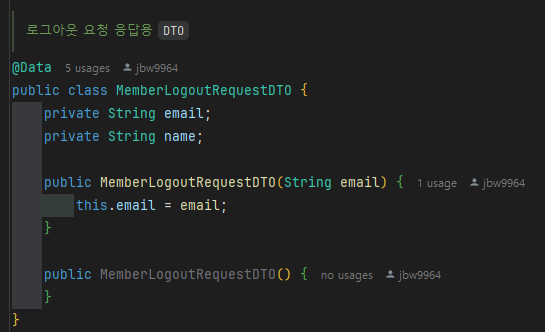
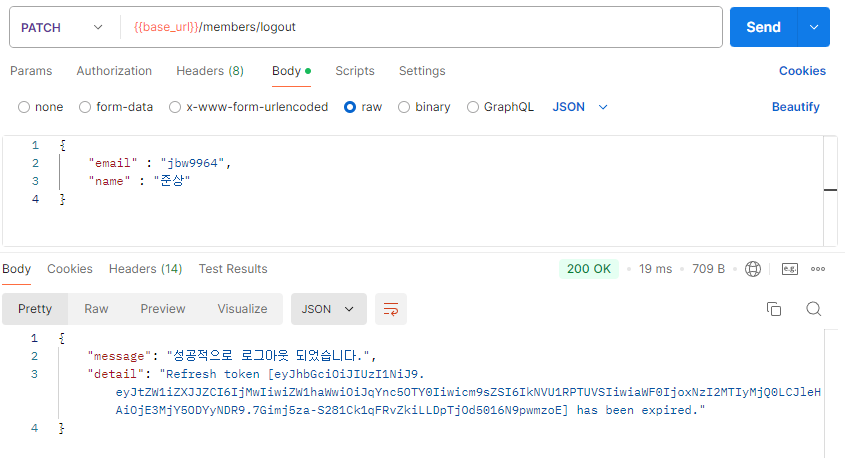

# 1 차 프로젝트 : 4 명의 아이들 (1-3팀)
Programmers DevCourse BE 1기 3팀의 1 차 프로젝트 repository 입니다.

---

# ☕ Grids & Circles 프로젝트

팀 `4 명의 아이들` 은 온라인 커피 주문 서비스를 가정한 RESTful API 를 개발하였습니다.

<!-- RESTful-API.PNG -->

    

<table>
    <tr height="140x">
    <!-- Image & Github nickname : paste block down below -->
        <td align="center" width="130px">
                <!-- github link, github profile image -->
             
            <a href="https://github.com/jbw9964"> 준상 </a>    <!-- github link & nickname -->
        </td>
        <td align="center" width="130px">
            
             
            <a href="https://github.com/kcsc2217"> 성원 </a>    
        </td>
        <td align="center" width="130px">
            
             
            <a href="https://github.com/Leehunil"> 훈일 </a>    
        </td>
        <td align="center" width="130px">
            
             
            <a href="https://github.com/InaJeong73"> 인아 </a>    
        </td>
    </tr>
</table>

---

## ✨ 저희 서비스는

- 🔐 로그인, 로그아웃을 지원합니다.
- 🛑 유저의 권한에 따라 API 요청을 제한합니다.
- 🏷 이전 주문에 상품을 추가, 주문을 취소할 수 있습니다.
- 💸 유저 등급별 상품 할인이 적용됩니다.
- ⏳ 매일 2 시 마다 상품이 배송됩니다.

## 세부적으로

- Refresh 토큰을 이용해 필요한 토큰을 재발급 받을 수 있습니다.
- 오직 관리자만 새로운 상품을 추가할 수 있습니다.
- 멤버 할인 등급은 총 3 가지가 있으며, 각각 `0%`, `10%`, `20%` 할인이 적용됩니다.
- 주문 생성, 취소, 상품 추가 시 멤버의 등급이 동적으로 적용됩니다.

> [`API 명세서`](https://documenter.getpostman.com/view/26753805/2sAXqmC65Z)

> 기술 스텍
>
> `Java17`, `Gradle`, `Spring Boot 3.3.3`, `Spring Data JPA 3.3.3`, `Json Web Token`, `Spring Security`, `Junit 5.10.3` `MySQL`
>
> ### ERD
>

> 

---

## 🧾 Team Convention

> Git 컨벤션
>
> - 목적에 따라 `feat/feature1`, `hotfix/bug-fix` 등 처럼 브랜치를 나눠 작업합니다.
>
> - 기능 구현, 버그 수정 등 작업을 마친 후 `develop` 브랜치에 합칠 `PR` 을 생성합니다.
> - 팀원들은 `PR` 에 궁금한 점, 칭찬할 점 등을 `PR review` 로 작성합니다.
> - 팀원간 토의를 통해 `merge` 혹은 브랜치 `conflict` 를 해결합니다.
> - 버그 발견, 추후 개선점 등은 `git issue` 로 작성합니다.

> Commit 컨벤션
>
> - 기능 단위로 커밋합니다.
> - `Commit type` 은 소문자로 작성합니다. (Feat → feat, Refactor → refactor 등)
>
> <!-- commit-convention.png -->
> > 

> >    
> > 

>
> - 개조식 구문으로 간결하고 요점적인 내용을 서술합니다.

---

## 📌 팀원별 담당한 부분

|   `팀원`   | `담당 부분`                               |
|:--------:|:--------------------------------------|
| [`준상`]() | 로그인, 회원가입 기능, `JWT` 토큰 관련 기능          |
| [`성원`]() | 팀 베이스 코드, `Spring Security`, `Filter` |
| [`훈일`]() | 상품 주문 기능, 주문 목록 조회, 주문 결제, 취소 기능      |
| [`인아`]() | 유저 등급별 할인 적용 구현                       |

---

### ⚠ 트러블 슈팅 경험

#### `/member/logout` endpoint 에서 유저의 권한을 요구하는 에러 트러블 슈팅

- 연관 이슈 : https://github.com/prgrms-be-devcourse/NBE1_1_4-children/issues/20
- 해결 PR : https://github.com/prgrms-be-devcourse/NBE1_1_4-children/pull/21

 자세히 보기

저희는 Access, Refresh 토큰을 이용한 인증을 기반으로 개발하였습니다.

그래서 아래 보시는 것처럼 로그인과 관련된 API 는 모두 허용하고, 그 외는 어느정도 권한이 필요하게 만들었습니다.

    

때문에 로그인 관련 API `/members/**` 는 어떠한 경우에도 권한 문제가 발생하지 않아야 합니다.

하지만 DB 의 Refresh 토큰을 없애는 `/memers/logout` API 를 확인하니 아래처럼 권한 문제가 발생하는 것을 확인했습니다.

    

    

문제의 원인은 `/member/logout` API 의 요청 `DTO` 때문이었습니다.

    

해당 `DTO` 에는 기본 생성자가 없어 JSON 파싱 시 에러가 발생하였습니다.

그런데 Spring Security 는 처리 중 에러가 발생하면  `/error` API 로 요청을 던져버리고, `/error` API 는 이전 `SecurityConfig` 에서 `authenticated` 로
설정하여 권한 문제가 발생한 것입니다.

이를 해결하기 위해 `DTO` 에 기본 생성자를 추가하였고, 추후 이처럼 `/error` 로 던져지는 경우를 잘 파악하고자 `/error` API 는 모든 요청이 접글할 수 있도록 수정하였습니다.

    

    

    

